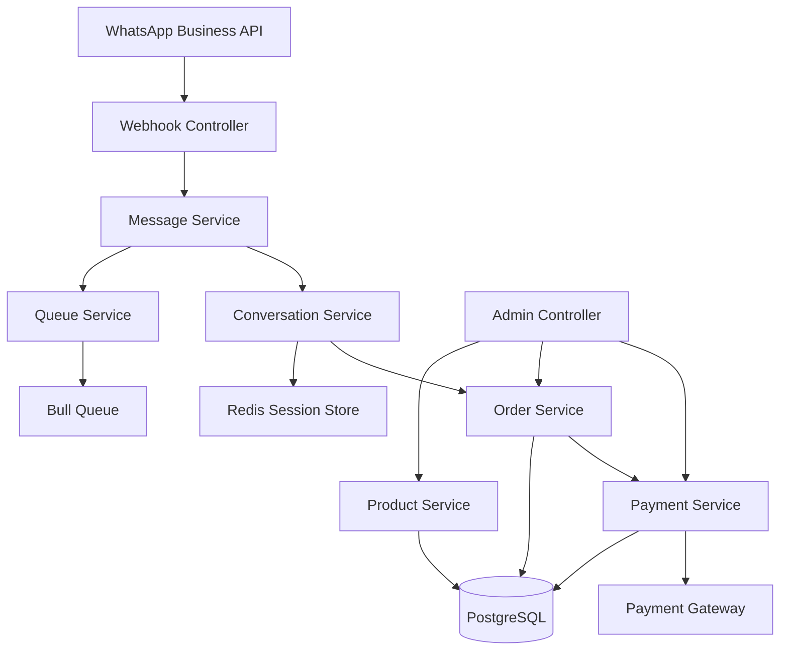

# Design Document

## Overview

The WhatsApp Order Bot is a NestJS-based microservice that integrates with WhatsApp Business API to handle customer orders through conversational commerce. The system uses a state machine approach to manage conversation flows, Drizzle ORM for database operations, and Redis for session management. The architecture follows clean architecture principles with clear separation between business logic, data access, and external integrations.

## Architecture

### High-Level Architecture



### Core Components

1. **Message Processing Layer**: Handles incoming WhatsApp messages and outgoing responses
2. **Conversation Management**: Manages conversation state and flow logic
3. **Order Management**: Handles product catalog, order creation, and order lifecycle
4. **Payment Processing**: Integrates with payment gateways and manages payment verification
5. **Session Management**: Maintains conversation context using Redis
6. **Queue System**: Handles async operations like payment processing and message retries

## Components and Interfaces

### 1. Message Processing Module

**WhatsApp Controller**
```typescript
@Controller('webhook/whatsapp')
export class WhatsAppController {
  @Post()
  handleIncomingMessage(@Body() payload: WhatsAppWebhookPayload): Promise<void>
  
  @Get()
  verifyWebhook(@Query() query: WebhookVerificationQuery): string
}
```

**Message Service**
```typescript
@Injectable()
export class MessageService {
  async processIncomingMessage(message: IncomingMessage): Promise<void>
  async sendMessage(to: string, content: MessageContent): Promise<void>
  async sendTemplate(to: string, template: TemplateMessage): Promise<void>
}
```

### 2. Conversation Management Module

**Conversation Service**
```typescript
@Injectable()
export class ConversationService {
  async getConversationState(phoneNumber: string): Promise<ConversationState>
  async updateConversationState(phoneNumber: string, state: ConversationState): Promise<void>
  async processUserInput(phoneNumber: string, input: string): Promise<BotResponse>
}
```

**Conversation State Machine**
```typescript
enum ConversationState {
  GREETING = 'greeting',
  BROWSING_PRODUCTS = 'browsing_products',
  ADDING_TO_CART = 'adding_to_cart',
  REVIEWING_ORDER = 'reviewing_order',
  AWAITING_PAYMENT = 'awaiting_payment',
  PAYMENT_CONFIRMATION = 'payment_confirmation',
  ORDER_COMPLETE = 'order_complete'
}
```

### 3. Order Management Module

**Order Service**
```typescript
@Injectable()
export class OrderService {
  async createOrder(customerId: string, items: OrderItem[]): Promise<Order>
  async calculateOrderTotal(items: OrderItem[]): Promise<number>
  async updateOrderStatus(orderId: string, status: OrderStatus): Promise<void>
  async getOrderHistory(customerId: string): Promise<Order[]>
}
```

**Product Service**
```typescript
@Injectable()
export class ProductService {
  async getAvailableProducts(): Promise<Product[]>
  async searchProducts(query: string): Promise<Product[]>
  async getProductById(id: string): Promise<Product>
  async updateProductAvailability(id: string, available: boolean): Promise<void>
}
```

### 4. Payment Processing Module

**Payment Service**
```typescript
@Injectable()
export class PaymentService {
  async generatePaymentInstructions(order: Order): Promise<PaymentInstructions>
  async verifyPayment(paymentReference: string): Promise<PaymentVerification>
  async processPaymentConfirmation(orderId: string, paymentData: PaymentData): Promise<void>
  async generateReceipt(orderId: string): Promise<Receipt>
}
```

### 5. Queue Management Module

**Queue Service**
```typescript
@Injectable()
export class QueueService {
  async addMessageToQueue(message: QueuedMessage): Promise<void>
  async addPaymentVerificationToQueue(paymentData: PaymentData): Promise<void>
  async addReceiptGenerationToQueue(orderId: string): Promise<void>
}
```

## Data Models

### Core Entities

**Customer Entity**
```typescript
export const customers = pgTable('customers', {
  id: uuid('id').primaryKey().defaultRandom(),
  phoneNumber: varchar('phone_number', { length: 20 }).unique().notNull(),
  name: varchar('name', { length: 100 }),
  createdAt: timestamp('created_at').defaultNow(),
  updatedAt: timestamp('updated_at').defaultNow()
});
```

**Product Entity**
```typescript
export const products = pgTable('products', {
  id: uuid('id').primaryKey().defaultRandom(),
  name: varchar('name', { length: 200 }).notNull(),
  description: text('description'),
  price: decimal('price', { precision: 10, scale: 2 }).notNull(),
  available: boolean('available').default(true),
  category: varchar('category', { length: 100 }),
  createdAt: timestamp('created_at').defaultNow(),
  updatedAt: timestamp('updated_at').defaultNow()
});
```

**Order Entity**
```typescript
export const orders = pgTable('orders', {
  id: uuid('id').primaryKey().defaultRandom(),
  customerId: uuid('customer_id').references(() => customers.id),
  status: orderStatusEnum('status').default('pending'),
  totalAmount: decimal('total_amount', { precision: 10, scale: 2 }).notNull(),
  paymentReference: varchar('payment_reference', { length: 100 }),
  createdAt: timestamp('created_at').defaultNow(),
  updatedAt: timestamp('updated_at').defaultNow()
});
```

**Order Items Entity**
```typescript
export const orderItems = pgTable('order_items', {
  id: uuid('id').primaryKey().defaultRandom(),
  orderId: uuid('order_id').references(() => orders.id),
  productId: uuid('product_id').references(() => products.id),
  quantity: integer('quantity').notNull(),
  unitPrice: decimal('unit_price', { precision: 10, scale: 2 }).notNull(),
  totalPrice: decimal('total_price', { precision: 10, scale: 2 }).notNull()
});
```

**Payment Entity**
```typescript
export const payments = pgTable('payments', {
  id: uuid('id').primaryKey().defaultRandom(),
  orderId: uuid('order_id').references(() => orders.id),
  amount: decimal('amount', { precision: 10, scale: 2 }).notNull(),
  paymentMethod: varchar('payment_method', { length: 50 }),
  paymentReference: varchar('payment_reference', { length: 100 }),
  status: paymentStatusEnum('status').default('pending'),
  verifiedAt: timestamp('verified_at'),
  createdAt: timestamp('created_at').defaultNow()
});
```

### Session Data Structure (Redis)

```typescript
interface ConversationSession {
  phoneNumber: string;
  currentState: ConversationState;
  currentOrder?: {
    items: Array<{
      productId: string;
      quantity: number;
      name: string;
      price: number;
    }>;
    totalAmount?: number;
  };
  lastActivity: Date;
  context: Record<string, any>;
}
```

## Error Handling

### Error Categories

1. **External Service Errors**
   - WhatsApp API failures: Implement exponential backoff retry with Bull Queue
   - Payment gateway timeouts: Queue payment verification for retry
   - Database connection issues: Use connection pooling and circuit breaker pattern

2. **Business Logic Errors**
   - Invalid product selections: Provide clear error messages and alternatives
   - Payment verification failures: Guide users through correction process
   - Order processing errors: Maintain order state and allow recovery

3. **User Input Errors**
   - Unrecognized commands: Provide help menu and command suggestions
   - Invalid quantities/formats: Request clarification with examples
   - Session timeouts: Gracefully restart conversation flow

### Error Response Strategy

```typescript
interface ErrorResponse {
  type: 'user_error' | 'system_error' | 'service_unavailable';
  message: string;
  suggestedActions?: string[];
  retryable: boolean;
}
```

## Testing Strategy

### Unit Testing
- **Services**: Mock external dependencies (WhatsApp API, Payment Gateway, Redis)
- **Controllers**: Test request/response handling and validation
- **State Machine**: Test all conversation flow transitions
- **Data Models**: Test Drizzle schema validation and relationships

### Integration Testing
- **Database Operations**: Test with real PostgreSQL instance
- **Redis Sessions**: Test session persistence and expiration
- **Queue Processing**: Test Bull Queue job processing
- **Webhook Handling**: Test WhatsApp webhook payload processing

### End-to-End Testing
- **Complete Order Flow**: Simulate full customer journey from greeting to receipt
- **Payment Verification**: Test payment confirmation workflows
- **Error Recovery**: Test system behavior during service outages
- **Load Testing**: Test concurrent conversation handling

### Testing Tools
- **Jest**: Unit and integration testing framework
- **Supertest**: HTTP endpoint testing
- **Redis Memory Server**: In-memory Redis for testing
- **PostgreSQL Test Container**: Isolated database testing
- **WhatsApp API Mocks**: Simulate webhook payloads and API responses

### Test Data Management
- **Fixtures**: Predefined test products, customers, and orders
- **Factories**: Dynamic test data generation
- **Database Seeding**: Consistent test environment setup
- **Cleanup**: Automated test data cleanup between test runs