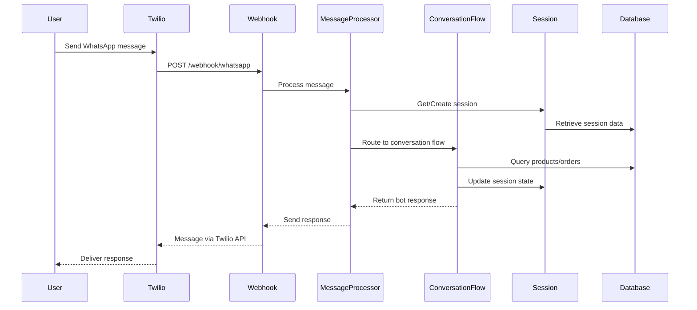

# API Documentation

## 📡 WhatsApp Webhook API

### Webhook Endpoint
**Base URL**: `https://your-domain.com/webhook/whatsapp`

### Authentication
- **Verification Token**: Set in environment variable `WHATSAPP_WEBHOOK_VERIFY_TOKEN`
- **Webhook Verification**: GET request with hub.challenge parameter

---

## 🔗 Endpoints

### 1. Webhook Verification (GET)
**Endpoint**: `GET /webhook/whatsapp`

**Purpose**: Verifies webhook with Twilio during setup

**Query Parameters**:
```typescript
interface WebhookVerificationQuery {
  'hub.mode': string;           // Should be 'subscribe'
  'hub.verify_token': string;   // Must match WHATSAPP_WEBHOOK_VERIFY_TOKEN
  'hub.challenge': string;      // Challenge string to return
}
```

**Response**:
```typescript
// Success (200)
string // Returns hub.challenge value

// Error (401)
{
  "statusCode": 401,
  "message": "Webhook verification failed"
}
```

**Example**:
```bash
GET /webhook/whatsapp?hub.mode=subscribe&hub.verify_token=my_token&hub.challenge=challenge_string
```

---

### 2. Incoming Messages (POST)
**Endpoint**: `POST /webhook/whatsapp`

**Purpose**: Receives incoming WhatsApp messages from Twilio

**Request Body** (Twilio Format):
```typescript
interface TwilioWebhookPayload {
  MessageSid: string;           // Unique message ID
  From: string;                 // Sender phone (whatsapp:+1234567890)
  To: string;                   // Bot phone (whatsapp:+14155238886)
  Body: string;                 // Message text content
  NumMedia?: string;            // Number of media attachments
  MediaUrl0?: string;           // First media URL (if any)
  MediaContentType0?: string;   // Media MIME type
}
```

**Response**:
```typescript
// Success (200)
{
  "status": "success"
}

// Error (400)
{
  "statusCode": 400,
  "message": "Invalid webhook payload"
}

// Error (500)
{
  "statusCode": 500,
  "message": "Internal server error processing webhook"
}
```

**Example Request**:
```json
{
  "MessageSid": "SM1234567890abcdef",
  "From": "whatsapp:+1234567890",
  "To": "whatsapp:+14155238886",
  "Body": "hello",
  "NumMedia": "0"
}
```

---

## 🤖 Bot Conversation Flow

### Message Processing Pipeline


### Conversation States
```typescript
enum ConversationState {
  GREETING = "greeting",                    // Initial welcome + menu
  COLLECTING_NAME = "collecting_name",      // Get customer name
  MAIN_MENU = "main_menu",                 // Main menu options
  BROWSING_PRODUCTS = "browsing_products",  // Show product catalog
  ADDING_TO_CART = "adding_to_cart",       // Product selection
  COLLECTING_QUANTITY = "collecting_quantity", // Quantity input
  REVIEWING_ORDER = "reviewing_order",      // Order review
  AWAITING_PAYMENT = "awaiting_payment",    // Payment processing
  PAYMENT_CONFIRMATION = "payment_confirmation", // Payment verification
  ORDER_COMPLETE = "order_complete"         // Order completion
}
```

### Bot Response Format
```typescript
interface BotResponse {
  message: string;                    // Text to send to user
  nextState?: ConversationState;      // Next conversation state
  context?: Record<string, any>;      // Updated session context
}
```

---

## 📱 Message Types

### 1. Text Messages
**Input**:
```json
{
  "MessageSid": "SM123...",
  "From": "whatsapp:+1234567890",
  "Body": "hello",
  "NumMedia": "0"
}
```

**Processing**:
- Parsed as text input
- Routed to current conversation state handler
- Response generated based on state machine logic

### 2. Media Messages (Future)
**Input**:
```json
{
  "MessageSid": "SM123...",
  "From": "whatsapp:+1234567890",
  "Body": "",
  "NumMedia": "1",
  "MediaUrl0": "https://api.twilio.com/media/123",
  "MediaContentType0": "image/jpeg"
}
```

**Processing**:
- Currently responds with "I can only process text messages"
- Future: Image recognition for menu items

---

## 🛒 Order Management API

### Internal Order Flow
```typescript
interface OrderFlowService {
  // Cart Operations
  addItemToCart(session: ConversationSession, productId: string, quantity: number): Promise<OrderFlowResult>
  removeItemFromCart(session: ConversationSession, productId: string): Promise<OrderFlowResult>
  getCartSummary(session: ConversationSession): CartSummary
  clearCart(session: ConversationSession): Promise<OrderFlowResult>
  
  // Order Operations
  validateCart(session: ConversationSession): Promise<ValidationResult>
  createOrderFromCart(session: ConversationSession, customerId: string): Promise<OrderFlowResult>
}
```

### Cart Summary Format
```typescript
interface CartSummary {
  items: CartItem[];
  itemCount: number;
  subtotal: number;
  tax: number;
  total: number;
}

interface CartItem {
  productId: string;
  productName: string;
  quantity: number;
  unitPrice: number;
  totalPrice: number;
}
```

---

## 🗄️ Database API

### Products Repository
```typescript
interface ProductsRepository {
  // Query Methods
  findAvailableProducts(options?: ProductSearchOptions): Promise<Product[]>
  findById(id: string): Promise<Product | null>
  searchProducts(searchTerm: string, options?: ProductSearchOptions): Promise<Product[]>
  findByCategory(category: string, options?: ProductSearchOptions): Promise<Product[]>
  
  // Management Methods
  create(productData: NewProduct): Promise<Product>
  update(id: string, updateData: Partial<NewProduct>): Promise<Product>
  updateStock(id: string, quantity: number): Promise<Product>
  setAvailability(id: string, available: boolean): Promise<Product>
}
```

### Orders Repository
```typescript
interface OrdersRepository {
  // Order Operations
  create(orderData: NewOrder): Promise<Order>
  findById(id: string): Promise<Order | null>
  findByCustomerId(customerId: string): Promise<Order[]>
  updateStatus(id: string, status: OrderStatus): Promise<Order>
  
  // Order Items
  addOrderItem(orderId: string, item: NewOrderItem): Promise<OrderItem>
  getOrderItems(orderId: string): Promise<OrderItem[]>
}
```

### Customers Repository
```typescript
interface CustomersRepository {
  // Customer Operations
  findByPhoneNumber(phoneNumber: string): Promise<Customer | null>
  findOrCreateByPhoneNumber(phoneNumber: string, name?: string): Promise<Customer>
  create(customerData: NewCustomer): Promise<Customer>
  update(id: string, updateData: Partial<NewCustomer>): Promise<Customer>
}
```

---

## 🔧 Session Management API

### Session Service
```typescript
interface ConversationSessionService {
  // Session Operations
  getSession(phoneNumber: string): Promise<ConversationSession | null>
  createSession(phoneNumber: string): Promise<ConversationSession>
  updateState(phoneNumber: string, state: ConversationState, context?: Record<string, any>): Promise<void>
  updateContext(phoneNumber: string, context: Record<string, any>): Promise<void>
  deleteSession(phoneNumber: string): Promise<void>
  
  // Session Management
  extendSession(phoneNumber: string): Promise<void>
  getSessionTTL(phoneNumber: string): Promise<number>
  getActiveSessions(): Promise<string[]>
}
```

### Session Data Structure
```typescript
interface ConversationSession {
  phoneNumber: string;
  currentState: ConversationState;
  context: Record<string, any>;
  createdAt: Date;
  lastActivity: Date;
}

// Context Keys
enum ContextKey {
  CURRENT_ORDER = "currentOrder",
  SELECTED_PRODUCTS = "selectedProducts",
  SELECTED_PRODUCT_FOR_QUANTITY = "selectedProductForQuantity",
  CUSTOMER_INFO = "customerInfo",
  CUSTOMER_NAME = "customerName",
  IS_NEW_CUSTOMER = "isNewCustomer",
  ORDER_ID = "orderId",
  PAYMENT_REFERENCE = "paymentReference",
  LAST_MESSAGE = "lastMessage"
}
```

---

## 🔒 Security & Validation

### Input Validation
```typescript
interface MessageValidation {
  // Structure Validation
  validateMessageStructure(message: IncomingMessage): ValidationResult
  
  // Content Validation
  validateMessageContent(content: string): ValidationResult
  
  // Business Logic Validation
  validateProductSelection(productId: string): Promise<ValidationResult>
  validateQuantity(quantity: number): ValidationResult
}
```

### Rate Limiting
- **Twilio Sandbox**: 9 messages per day (free tier)
- **Production**: Based on Twilio plan
- **Development Mode**: Unlimited (logs to console)

### Error Handling
```typescript
interface ErrorResponse {
  type: 'user_error' | 'system_error' | 'service_unavailable';
  message: string;
  suggestedActions?: string[];
  retryable: boolean;
}
```

---

## 🧪 Testing API

### Webhook Testing
```bash
# Test webhook verification
curl -X GET "http://localhost:4000/webhook/whatsapp?hub.mode=subscribe&hub.verify_token=your_token&hub.challenge=test_challenge"

# Test incoming message
curl -X POST http://localhost:4000/webhook/whatsapp \
  -H "Content-Type: application/json" \
  -d '{
    "MessageSid": "test123",
    "From": "whatsapp:+1234567890",
    "To": "whatsapp:+14155238886",
    "Body": "hello",
    "NumMedia": "0"
  }'
```

### Development Mode Testing
```bash
# Enable development mode
export WHATSAPP_DEV_MODE=true

# Messages will be logged instead of sent:
# 🚀 DEV MODE - Would send message to +1234567890:
# 📱 Message: Hi there! My name is Leo...
# 📊 Content Type: text
```

---

## 📊 Monitoring & Analytics

### Health Check Endpoints
```typescript
// Application Health
GET /health
Response: { status: 'ok', timestamp: '2024-01-01T00:00:00Z' }

// Database Health  
GET /health/database
Response: { status: 'ok', connection: 'active', responseTime: 45 }

// Redis Health
GET /health/redis
Response: { status: 'ok', connection: 'active', memory: '2.1MB' }
```

### Metrics Collection
```typescript
interface ConversationMetrics {
  totalSessions: number;
  sessionsByState: Record<ConversationState, number>;
  averageResponseTime: number;
  errorRate: number;
  completedOrders: number;
}
```

---

## 🔄 Webhook Configuration

### Twilio Setup
1. **Webhook URL**: `https://your-domain.com/webhook/whatsapp`
2. **HTTP Method**: POST
3. **Webhook Events**: Incoming messages
4. **Verify Token**: Set in environment variables

### ngrok for Development
```bash
# Install ngrok
npm install -g ngrok

# Expose local server
ngrok http 4000

# Use the HTTPS URL in Twilio webhook configuration
# Example: https://abc123.ngrok.io/webhook/whatsapp
```

---

This API documentation covers all the key endpoints and interfaces for the WhatsApp Order Bot system. Use this as a reference for integration and development.