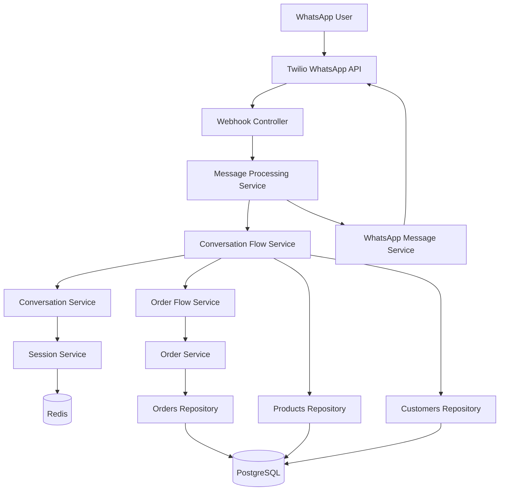
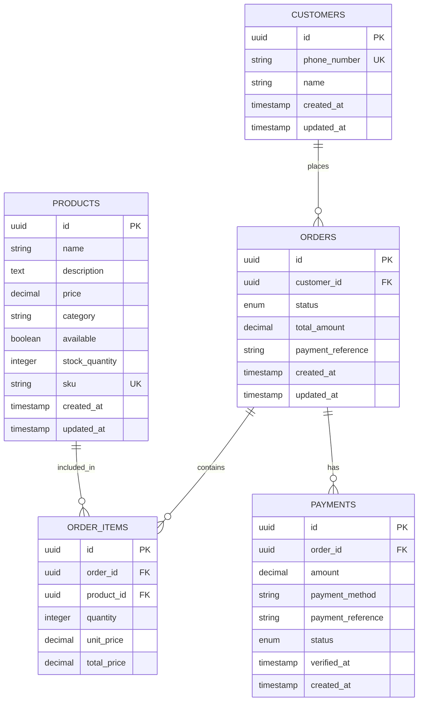

# Technical Architecture Documentation

## 🏗️ System Architecture

### High-Level Architecture Diagram


## 📦 Module Architecture

### 1. Conversations Module
**Purpose**: Core conversation logic and state management

```typescript
// State Machine Flow
GREETING → BROWSING_PRODUCTS → ADDING_TO_CART → COLLECTING_QUANTITY → ADDING_TO_CART
                                     ↓
                              REVIEWING_ORDER → AWAITING_PAYMENT → PAYMENT_CONFIRMATION → ORDER_COMPLETE
```

**Key Components**:
- `ConversationFlowService` - State machine implementation
- `ConversationService` - High-level orchestration
- `OrderFlowService` - Cart and order management
- `ConversationSessionService` - Redis session management

**State Handlers**:
```typescript
interface StateHandler {
  handleGreetingState(): Promise<BotResponse>
  handleBrowsingProductsState(): Promise<BotResponse>
  handleAddingToCartState(): Promise<BotResponse>
  handleCollectingQuantityState(): Promise<BotResponse>
  // ... other states
}
```

### 2. WhatsApp Module
**Purpose**: WhatsApp Business API integration

**Message Flow**:
```
Incoming: WhatsApp → Twilio → Webhook → Message Processing → Conversation Flow
Outgoing: Conversation Flow → WhatsApp Message Service → Twilio → WhatsApp
```

**Key Features**:
- Webhook verification and message parsing
- Development mode for testing without sending messages
- Rate limit handling and fallback mechanisms
- Message validation and error handling

### 3. Database Layer
**Purpose**: Data persistence and management

**Schema Design**:
```sql
-- Core Tables
customers (id, phone_number, name, created_at, updated_at)
products (id, name, description, price, category, available, stock_quantity)
orders (id, customer_id, status, total_amount, payment_reference)
order_items (id, order_id, product_id, quantity, unit_price, total_price)
payments (id, order_id, amount, payment_method, status, verified_at)
```

**Repository Pattern**:
```typescript
interface Repository<T> {
  create(data: NewT): Promise<T>
  findById(id: string): Promise<T | null>
  update(id: string, data: Partial<T>): Promise<T>
  delete(id: string): Promise<boolean>
}
```

## 🔄 Data Flow

### 1. Message Processing Flow
```
1. WhatsApp User sends message
2. Twilio receives and forwards to webhook
3. WhatsAppWebhookController validates and parses
4. MessageProcessingService processes message
5. ConversationFlowService determines state and response
6. Response sent back through WhatsAppMessageService
7. Twilio delivers response to user
```

### 2. Session Management Flow
```
1. User message arrives with phone number
2. ConversationSessionService checks Redis for existing session
3. If no session exists, creates new session with GREETING state
4. Session context updated with conversation data
5. Session persisted to Redis with TTL
```

### 3. Order Processing Flow
```
1. User selects product (number or name)
2. Product validated and stored in session context
3. Quantity collected and validated
4. OrderFlowService adds item to cart (session-based)
5. Cart summary calculated with tax
6. Order created when user proceeds to checkout
7. Payment processing initiated
```

## 🗄️ Database Design

### Entity Relationships


### Indexes and Performance
```sql
-- Performance Indexes
CREATE INDEX idx_customers_phone ON customers(phone_number);
CREATE INDEX idx_products_available ON products(available) WHERE available = true;
CREATE INDEX idx_products_category ON products(category);
CREATE INDEX idx_orders_customer ON orders(customer_id);
CREATE INDEX idx_orders_status ON orders(status);
CREATE INDEX idx_order_items_order ON order_items(order_id);
CREATE INDEX idx_payments_order ON payments(order_id);
CREATE INDEX idx_payments_status ON payments(status);
```

## 🔧 Configuration Management

### Environment Configuration
```typescript
interface AppConfig {
  // Application
  nodeEnv: 'development' | 'production' | 'test'
  port: number
  
  // Database
  databaseUrl: string
  
  // Redis
  redisHost: string
  redisPort: number
  redisPassword?: string
  
  // WhatsApp/Twilio
  twilioAccountSid: string
  twilioAuthToken: string
  twilioWhatsappNumber: string
  whatsappWebhookVerifyToken: string
  whatsappDevMode: boolean
  
  // Business
  businessName: string
  taxRate: number
  paymentTimeoutMinutes: number
}
```

### Feature Flags
```typescript
interface FeatureFlags {
  enablePaymentProcessing: boolean
  enableCustomerRecognition: boolean
  enableOrderTracking: boolean
  enableMultiLanguage: boolean
}
```

## 🚀 Deployment Architecture

### Development Environment
```yaml
services:
  app:
    build: .
    ports: ["4000:4000"]
    environment:
      - NODE_ENV=development
      - WHATSAPP_DEV_MODE=true
    depends_on: [postgres, redis]
  
  postgres:
    image: postgres:15
    environment:
      POSTGRES_DB: whatsapp_bot
      POSTGRES_USER: postgres
      POSTGRES_PASSWORD: password
    ports: ["5432:5432"]
  
  redis:
    image: redis:7-alpine
    ports: ["6379:6379"]
```

### Production Considerations
- **Database**: Use managed PostgreSQL (Supabase, AWS RDS)
- **Redis**: Use managed Redis (AWS ElastiCache, Redis Cloud)
- **Scaling**: Horizontal scaling with load balancer
- **Monitoring**: Application metrics and health checks
- **Security**: Environment variable encryption, API rate limiting

## 🔒 Security Considerations

### Data Protection
- Phone numbers encrypted in database
- Session data expires automatically
- Payment information handled securely
- Input validation and sanitization

### API Security
- Webhook signature verification
- Rate limiting on endpoints
- CORS configuration
- Request size limits

### Access Control
- Environment-based configuration
- Secure credential management
- Database connection encryption
- Redis authentication

## 📊 Performance Optimization

### Caching Strategy
```typescript
// Session Caching (Redis)
- Conversation sessions: 30 minutes TTL
- Customer data: 24 hours TTL
- Product catalog: 1 hour TTL

// Database Optimization
- Connection pooling: 10-20 connections
- Query optimization with indexes
- Prepared statements for common queries
```

### Monitoring Metrics
- Response time per conversation state
- Database query performance
- Redis hit/miss ratios
- WhatsApp API rate limit usage
- Error rates by module

## 🧪 Testing Strategy

### Unit Tests
```typescript
// Service Layer Tests
describe('ConversationFlowService', () => {
  it('should handle greeting state correctly')
  it('should validate product selection')
  it('should manage cart operations')
})

// Repository Tests
describe('ProductsRepository', () => {
  it('should find available products')
  it('should handle stock updates')
})
```

### Integration Tests
```typescript
// End-to-End Conversation Flow
describe('Order Flow Integration', () => {
  it('should complete full order process')
  it('should handle cart modifications')
  it('should process payment confirmation')
})
```

### Test Data Management
```typescript
// Test Fixtures
const testProducts = [
  { name: 'Test Burger', price: '5500.00', category: 'Burgers' }
]

const testCustomer = {
  phoneNumber: '+1234567890',
  name: 'Test Customer'
}
```

## 🔄 Error Handling Strategy

### Error Categories
1. **User Input Errors**: Invalid selections, malformed input
2. **System Errors**: Database failures, API timeouts
3. **Business Logic Errors**: Out of stock, invalid operations
4. **External Service Errors**: WhatsApp API failures

### Error Recovery
```typescript
interface ErrorRecovery {
  retryableErrors: string[]
  fallbackResponses: Record<string, string>
  escalationPaths: Record<string, string>
}
```

### Logging Strategy
```typescript
// Structured Logging
logger.info('Message processed', {
  phoneNumber: '+1234567890',
  messageId: 'msg_123',
  state: 'ADDING_TO_CART',
  processingTime: 150
})

logger.error('Database error', {
  error: error.message,
  query: 'SELECT * FROM products',
  phoneNumber: '+1234567890'
})
```

---

This architecture supports scalable, maintainable conversational commerce with clear separation of concerns and robust error handling.